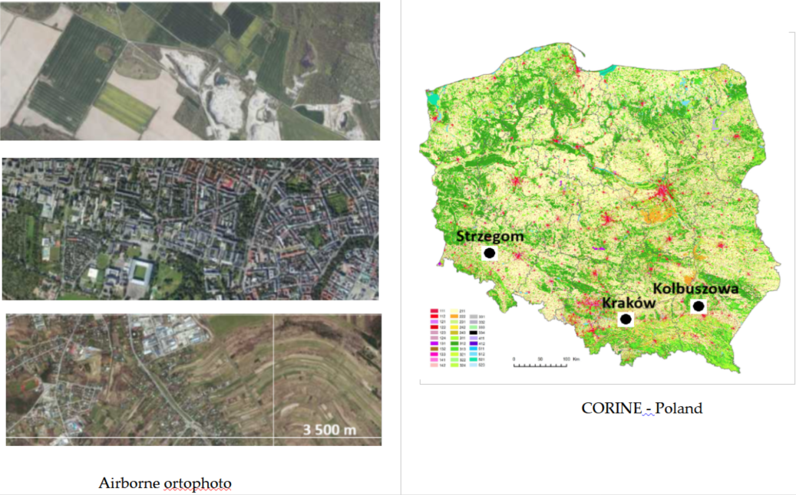

# 🛰️ Evaluating Classification Accuracy in Machine Learning  
### *A Case Study on Land Use and Land Cover Classification in Mining Regions*

**Authors**:  
Beata Hejmanowska https://home.agh.edu.pl/~galia/ [🔗 ORCID: 0000-0003-0230-8386]  
Krystyna Michałowska  [🔗 ORCID: 0000-0001-7749-3622]  
Piotr Kramarczyk  
Ewa Głowienka  [🔗 ORCID: 0000-0001-7326-1592]  

---

## 🧾 Project Overview

This repository contains data and classification results of Sentinel-2 imagery for **Land Use and Land Cover (LULC)** mapping in **mining regions**.  
The primary objective is the **detection of open-pit mines**.

A specific class division was tested to allow for consistent classification across Sentinel-2 images from different acquisition dates.  
This required, among others, a thoughtful approach to arable land classification.

## 🗺️ Test Areas and Geographic Locations

The study was conducted in three representative locations in Poland, selected for their contrasting land use characteristics:

### 📍 Strzegom  
- **Coordinates**: 50.963° N, 16.351° E  
- **Description**: An active mining region in Lower Silesia, characterized by open-pit granite quarries and industrial land use surrounded by fragmented agricultural fields and forest patches.

### 📍 Kolbuszowa  
- **Coordinates**: 50.243° N, 21.777° E  
- **Description**: A typical agricultural landscape in southeastern Poland, with a mosaic of croplands, grasslands, and rural settlements. No active mining is present.

### 📍 Kraków  
- **Coordinates**: 50.064° N, 19.945° E  
- **Description**: A densely built urban environment representing residential, commercial, and mixed land use, used as a reference for urban classification validation.

---

*Figure: Location of the test areas over the CORINE Land Cover 2018 map of Poland. Black dots mark the reference points used for classification.*
Jeśli chcesz, mogę też dodać skalę, nazwę układu odniesienia (EPSG) albo przekształcić to do LaTeX.

---

## 🗂️ Folder Structure

- 📁 `img_train` — multi-temporal Sentinel-2 image stacks  
- 📁 `training_masks` — annotated Sentinel-2 masks based on a unified legend  
- 📁 `test_mask` — single annotated test image  
- 📁 `accuracy_analysis` — classification accuracy evaluation results  

---

## 🌍 Adopted LULC Classes

The following classes were adopted in our study:

1. 🌲 <strong>Conifer forest</strong>
2. 🌳 <strong>Mix forest</strong>
3. 🏙️ <strong>Urban</strong>
4. 🌾 <strong>Crops</strong>: crops before harvest or in spring before agrotechnical treatments
5. 🟤 <strong>Bare soils</strong>
6. 🌿 <strong>Permanent grassland</strong>
7. 🛣️ <strong>Roads</strong>
8. 🌊 <strong>Waters</strong>
9. 🌱 <strong>Crops in vegetation stage</strong>
10. ⛏️ <strong>Quarries, open pits</strong>

---

## 📏 Accuracy Evaluation

The classification accuracy was evaluated using standard metrics including:

- **Overall Accuracy**
- **Kappa Coefficient**
- **Precision, Recall, F1-Score**
- **Producer’s and User’s Accuracy**
- **Confusion Matrix**
- **more in the `accuracy_analysis` folder.

---

## 🤝 Call for Collaboration

We encourage the use of our dataset for testing and benchmarking classification methods.  
Feel free to cite this work or contact us for further collaboration.

